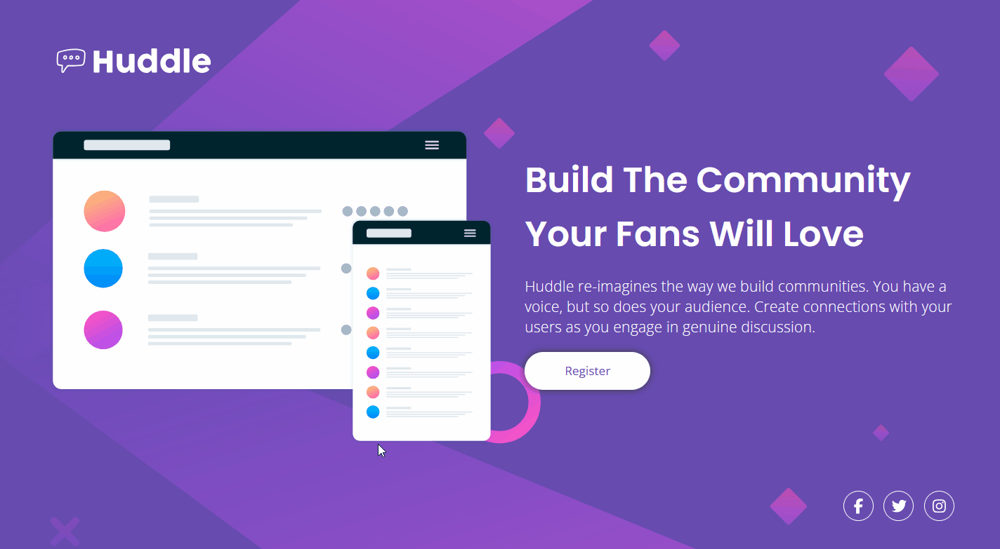
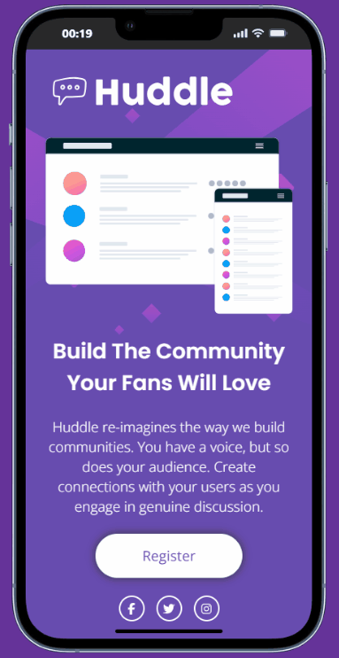

# Huddle landing page with a single introductory section — Frontend Mentor Challenge

## 📌 Overview

### 🎯 The challenge

Your challenge is to build this landing page from the designs provided in the starter code.

You can use any tools you like to help you complete the challenge. So if you have something you’d like to practice, feel free to give it a go.

Your users should be able to:

- View the optimal layout for the page depending on their device’s screen size
- See hover states for all interactive elements on the page

-----

### 📷 Screenshots

  
  

### 🔗 Links

- The challenge: [Frontend Mentor](https://www.frontendmentor.io/challenges/huddle-landing-page-with-a-single-introductory-section-B_2Wvxgi0)
- My solution: [Demo](https://ruannldr.github.io/Frontend-Mentor-Solutions/Solutions/Huddle-Landing-Page/)

-----

## 📝 My process

### Built with

   

### Personal comments

There was a huge difficulty regarding the fixed positioning of elements.

I use a display screen smaller than the project’s total fixed size, which became a problem because at different zoom levels the elements would move in a disconnected way instead of moving or not moving intelligently.

For example, the `.container-action` aligned with the specific height of the image. I believe using `padding-top` was not a good idea; but beyond the uncertainty, I didn’t want to use a fixed number with `px`.

### Next steps

As my first project I felt what I really need to improve and focus on; and that is exactly what I will do. I will practice more and more, especially where I feel the most difficulty.

-----

## Author

- GitHub — [Luênder](https://github.com/ruannldr)
- Frontend Mentor — [@ruannldr](https://www.frontendmentor.io/profile/ruannldr)

-----

 

 

