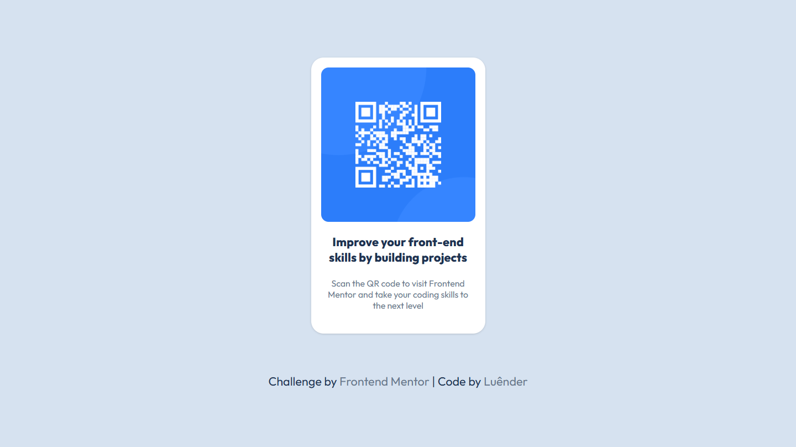
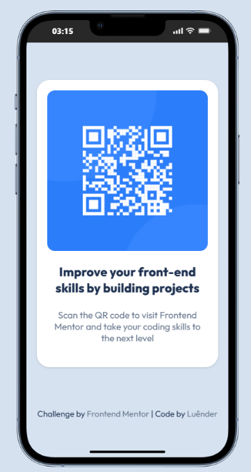

# QR Code Component — Desafio Frontend Mentor

  
  

## 📌 Overview

### 🎯 The challenge

Your challenge is to build out this QR code component and get it looking as close to the design as possible.

You can use any tools you like to help you complete the challenge. So if you've got something you'd like to practice, feel free to give it a go.

---

### 📷 Screenshots

---

  
  

### 🔗 Links

- The challenge: [Frontend Mentor](https://www.frontendmentor.io/challenges/huddle-landing-page-with-a-single-introductory-section-B_2Wvxgi0)
- My solution: [Demo](https://ruannldr.github.io/Frontend-Mentor-Solutions/Solutions/Huddle-Landing-Page/)

---

## 📝 My process

### Built with

  

### Personal comments

This project was the easiest one in this journey. I learned a lot from it. I still have some difficulty with positioning elements, but I’m getting the hang of it.

### Next steps

I’ll keep working on basic projects for a few more days.

---

## Author

- GitHub — [Luênder](https://github.com/ruannldr)
- Frontend Mentor — [@ruannldr](https://www.frontendmentor.io/profile/ruannldr)

---

 

 

