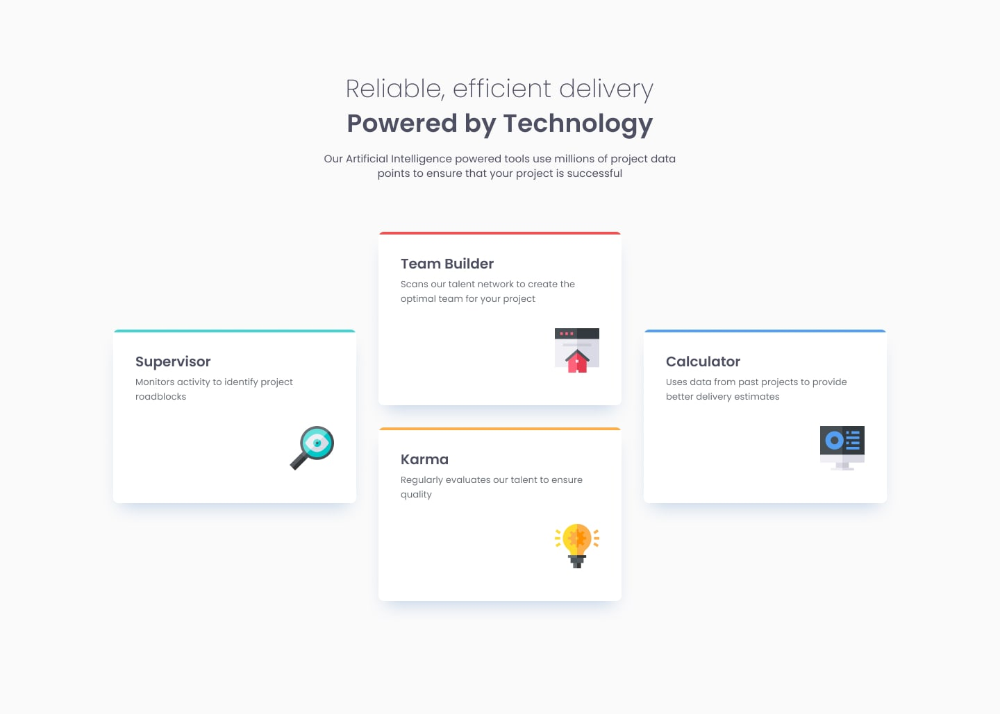
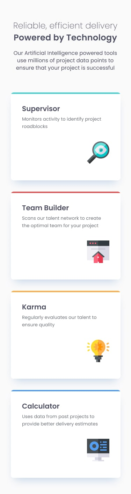
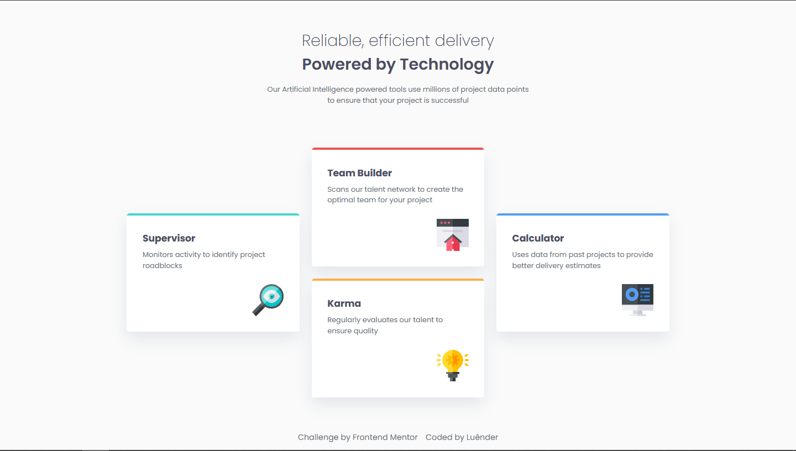
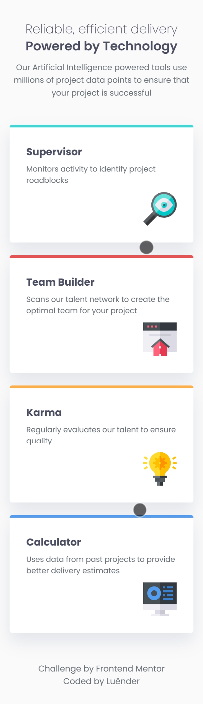

# Four Card Feature Section | Desafio Frontend Mentor

  
  

## 📌 Visão geral

### 🎯 O desafio

Seu desafio é desenvolver esta seção de recursos e deixá-la o mais próxima possível do design.

Você pode usar qualquer ferramenta que desejar para ajudá-lo(a) a concluir o desafio. Portanto, se tiver alguma ferramenta que gostaria de praticar, fique à vontade para tentar.

Seus usuários devem:

- Visualizar o layout ideal para o site, de acordo com o tamanho da tela do dispositivo.

---

### 📷 Screenshots

---

  
  

### 🔗 Links

- O desafio: [Frontend Mentor](https://www.frontendmentor.io/challenges/four-card-feature-section-weK1eFYK)
- Minha solução: [Demo](https://ruannldr.github.io/Frontend-Mentor-Solutions/Solutions/four-card-feature-section-master/)

---

## 📝 Meu processo

### Construído com

### Comentários pessoais

Foi um projeto dificil porque tive que colocar em pratica o grid que ainda tenho bastante dificuldade, mas aprendi bastante sobre e ainda pude entender melhor só tamanhos de layouts e utilização mais eficaz de tags e propriedades em seus devidos lugares.

### Próximos passos

Como projeto anterior irei seguir estudando e realizando mais projetos até me sentir confortavel para subir de nivel.

---

## Autor

- GitHub — [Luênder](https://github.com/ruannldr)
- Frontend Mentor — [@ruannldr](https://www.frontendmentor.io/profile/ruannldr)

---

 

 

