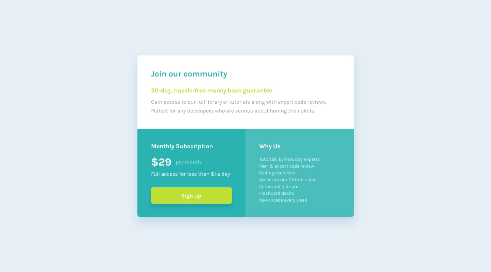
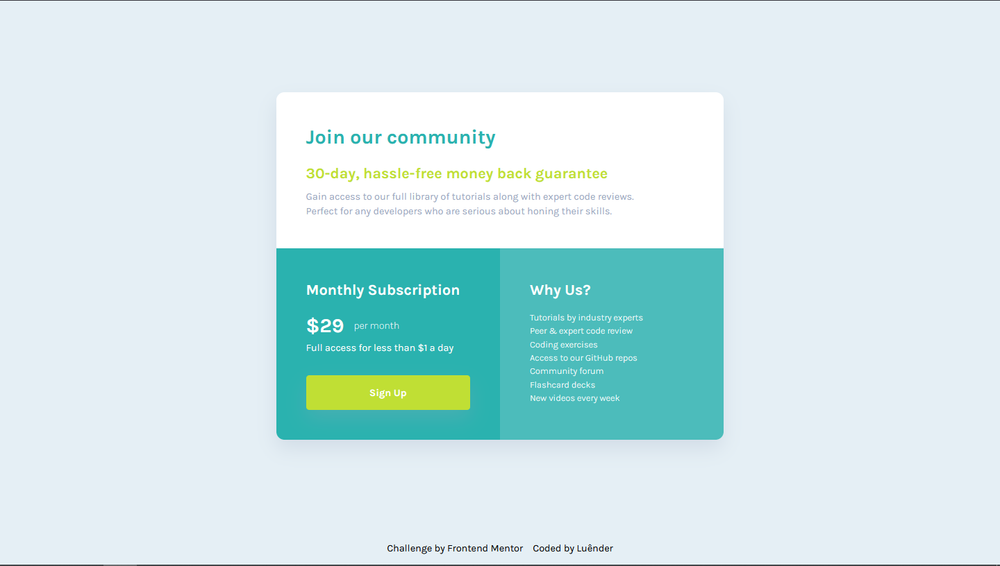
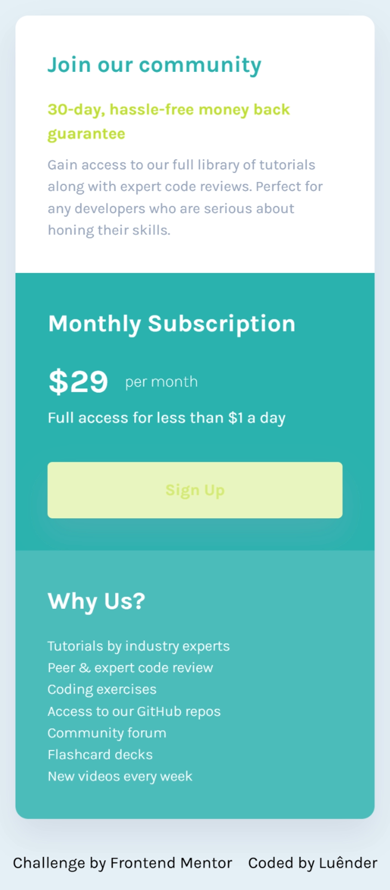

# Single Price Grid Componet — Desafio Frontend Mentor

  
  

## 📌 Visão geral

### 🎯 O desafio

Seu desafio é construir este componente de QR code e deixá-lo o mais parecido possível com o design.

Você pode usar qualquer ferramenta que quiser para ajudar a completar o desafio. Então, se tiver algo que gostaria de praticar, sinta-se livre para tentar.

---

### 📷 Screenshots

---

  
  

### 🔗 Links

- O desafio: [Frontend Mentor](https://www.frontendmentor.io/challenges/qr-code-component-iux_sIO_H)
- Minha solução: [Demo](https://ruannldr.github.io/Frontend-Mentor-Solutions/Solutions/QR-code-component/)

---

## 📝 Meu processo

### Construído com

---

## Autor

- GitHub — [Luênder](https://github.com/ruannldr)
- Frontend Mentor — [@ruannldr](https://www.frontendmentor.io/profile/ruannldr)

---

 

 
